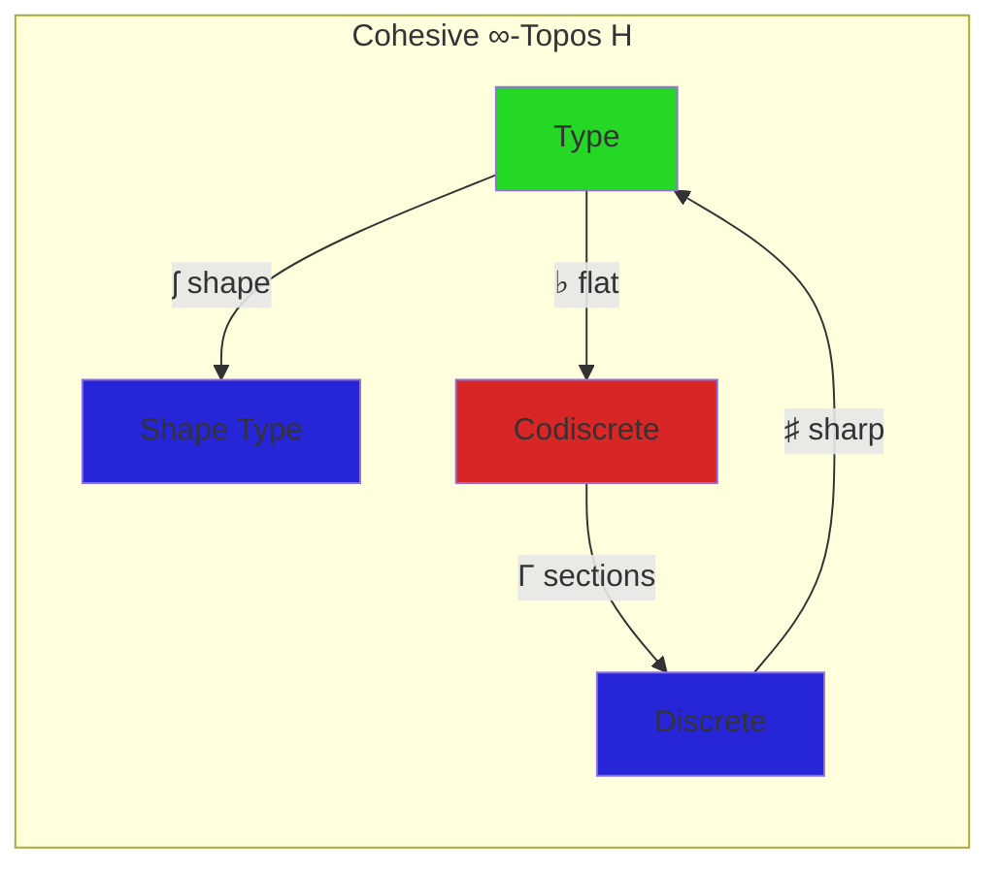
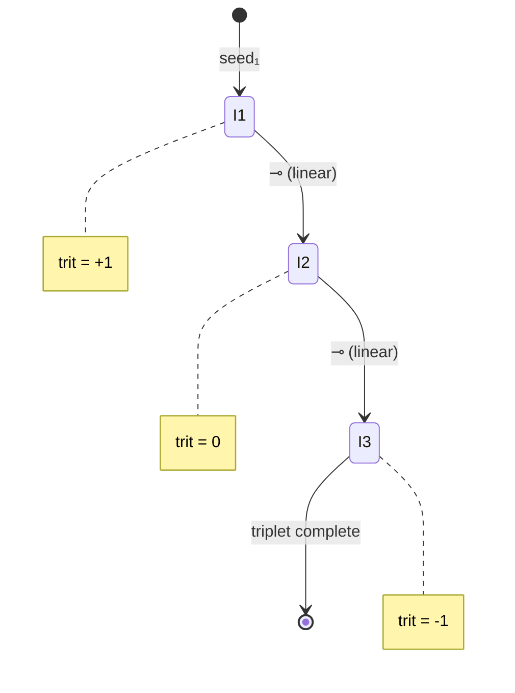
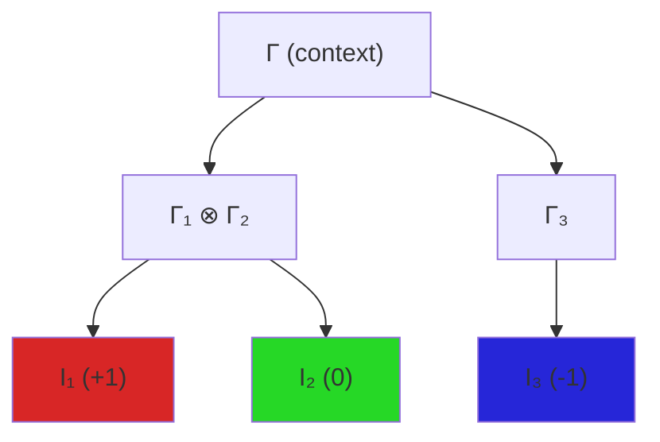

# LHoTT Cohesive Linear Skill

Synthesizes Urs Schreiber's cohesive ∞-topos framework with Mitchell Riley's linear HoTT for interaction entropy formalization.

## Modal Operators

| Modality | Symbol | Action | Interaction Use |
|----------|--------|--------|-----------------|
| Sharp | ♯ | Discretize | Extract trit from color |
| Flat | ♭ | Embed continuously | Full LCH embedding |
| Shape | ʃ | Quotient by homotopy | Walk trajectory class |
| Linear | ♮ | Self-adjoint tangent | One-use interaction |

## GF(3) Triad Placement

This skill is **ERGODIC (0)**, forming triads with:

```
persistent-homology (-1) ⊗ lhott-cohesive-linear (0) ⊗ topos-generate (+1) = 0 ✓
sheaf-cohomology (-1) ⊗ lhott-cohesive-linear (0) ⊗ gay-mcp (+1) = 0 ✓
three-match (-1) ⊗ lhott-cohesive-linear (0) ⊗ rubato-composer (+1) = 0 ✓
```

## Core Types (Pseudo-HoTT)

```hott
-- Cohesive interaction type
CohesiveInteraction : Type
  content : String
  hash : ♯ SHA256           -- discrete
  seed : ♭ UInt64           -- continuous embedding
  color : ♮ LCH             -- linear (used once)
  position : ʃ (ℤ × ℤ)      -- shape-invariant

-- Linear function (no copy/delete)
walk_step : CohesiveInteraction ⊸ Position × Color

-- Bunched triplet (entangled context)
Γ₁ ⊗ Γ₂ ⊗ Γ₃ ⊢ conserved : GF3Zero
  where trit(Γ₁) + trit(Γ₂) + trit(Γ₃) ≡ 0 (mod 3)
```

## Diagram Generation

### Mermaid Templates

**Cohesive Quadruple:**


**Linear Walk:**


**Bunched Context Tree:**


## Ruby Integration

```ruby
module LHoTTCohesiveLinear
  # Modalities
  SHARP  = ->(x) { { trit: x[:trit] } }  # ♯ discretize
  FLAT   = ->(x) { x }                    # ♭ full embed
  SHAPE  = ->(x) { x[:position] }         # ʃ trajectory
  LINEAR = ->(x) { x.dup.freeze }         # ♮ freeze for one use
  
  def self.cohesive_interaction(content)
    hash = Digest::SHA256.hexdigest(content)
    seed = hash[0..15].to_i(16)
    gen = SplitMixTernary::Generator.new(seed)
    color = gen.next_color
    
    {
      content: content,
      hash: SHARP.call({ trit: color[:trit] }),  # ♯
      seed: FLAT.call(seed),                      # ♭
      color: LINEAR.call(color),                  # ♮
      position: nil  # computed by walk
    }
  end
  
  def self.linear_walk_step(interaction, walker)
    raise "Linear resource already consumed" if interaction.frozen?
    result = walker.step!(interaction)
    interaction.freeze  # consume linear resource
    result
  end
end
```

## Julia Integration

```julia
# ACSets schema for LHoTT
@present SchLHoTT(FreeSchema) begin
  CohesiveType::Ob
  LinearType::Ob
  
  sharp::Hom(CohesiveType, CohesiveType)   # ♯
  flat::Hom(CohesiveType, CohesiveType)    # ♭
  shape::Hom(CohesiveType, CohesiveType)   # ʃ
  linear::Hom(CohesiveType, LinearType)    # ♮
  
  Trit::AttrType
  trit_attr::Attr(LinearType, Trit)
end
```

## Hy/DiscoHy Integration

```hy
(import [discopy [Ty Box Diagram monoidal]])

(defn cohesive-box [name input output modality]
  "Create DisCoPy box with modality annotation"
  (setv color (case modality
    "sharp" "#2626D8"
    "flat" "#D82626"
    "shape" "#26D826"
    "linear" "#FFAA00"))
  (Box name (Ty input) (Ty output) :color color))

(defn lhott-diagram [interactions]
  "Build monoidal diagram from interaction sequence"
  (setv boxes (lfor i interactions
    (cohesive-box (get i "skill_name")
                  "State" "State"
                  (get i "modality" "linear"))))
  (reduce monoidal.compose boxes))
```

## Diagram Export Commands

```bash
# Generate Mermaid diagram from interactions
just lhott-diagram mermaid

# Generate base64 PNG from Mermaid
just lhott-diagram png > diagram.base64

# Export to DisCoPy SVG
just lhott-discopy-svg

# Full pipeline: interactions → ACSet → DisCoPy → Mermaid
just lhott-full-export
```

## Key Theorems

1. **Cohesive Determinism**: `hash ∘ ♯ = ♯ ∘ hash` (discretization commutes)
2. **Linear Conservation**: `|consumed| = |interactions|` (no copy/delete)
3. **GF(3) Invariant**: `Σ trit(Iᵢ) ≡ 0 (mod 3)` per triplet
4. **Spectral Verification**: `P(verify) = 1/4` (Ramanujan gap)

## References

- Corfield, D. (2025). "Linear Homotopy Type Theory: Its Origins and Potential Uses"
- Schreiber, U. (2014). "Quantization via Linear Homotopy Types"
- Riley, M. (2022). "A Bunched Homotopy Type Theory for Synthetic Stable Homotopy Theory"
- [nLab: Cohesive HoTT](https://ncatlab.org/nlab/show/cohesive+homotopy+type+theory)
