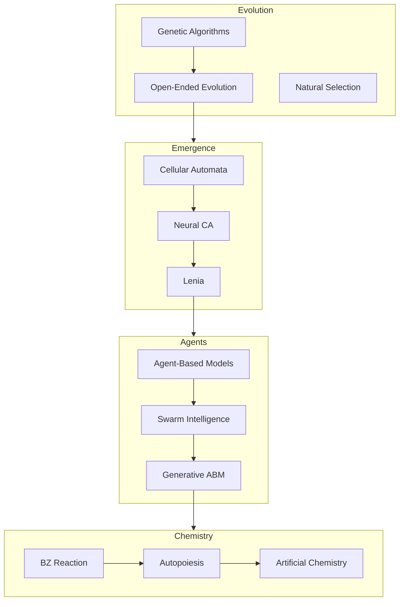

# ALIFE: Artificial Life Comprehensive Skill

**Status**: ✅ Production Ready
**Trit**: +1 (PLUS - generative/creative)
**Sources**: ALIFE2025 Proceedings + Classic Texts + Code Repos

## Quick Reference

| Resource | Content |
|----------|---------|
| **ALIFE2025** | 337 pages, 80+ papers, 153 figures, 100+ equations |
| **Axelrod** | Evolution of Cooperation, TIT-FOR-TAT, Prisoner's Dilemma |
| **Epstein-Axtell** | Sugarscape, Growing Artificial Societies |
| **ALIEN** | CUDA 2D particle engine (ALIFE 2024 winner) |
| **Lenia** | Continuous cellular automata |
| **Concordia** | DeepMind generative agent-based models |

## Core Concepts

### 1. Evolutionary Dynamics

```latex
% Fitness-proportionate selection
P(i) = \frac{f_i}{\sum_{j=1}^{N} f_j}

% Replicator dynamics
\dot{x}_i = x_i \left[ f_i(x) - \bar{f}(x) \right]
```

### 2. Prisoner's Dilemma & Cooperation

```
         Cooperate    Defect
Cooperate   R,R        S,T
Defect      T,S        P,P

where T > R > P > S (temptation > reward > punishment > sucker)
```

**TIT-FOR-TAT Strategy** (Axelrod):
1. Cooperate on first move
2. Then do whatever opponent did last round

Properties: **Nice** (never defects first), **Retaliatory**, **Forgiving**, **Clear**

### 3. Cellular Automata

**Elementary CA** (Wolfram):
```
Rule 110: [111→0] [110→1] [101→1] [100→0] [011→1] [010→1] [001→1] [000→0]
```

**Lenia** (Continuous CA):
```latex
A^{t+\Delta t} = \left[ A^t + \Delta t \cdot G(K * A^t) \right]_0^1

G_{\mu,\sigma}(x) = 2e^{-\frac{(x-\mu)^2}{2\sigma^2}} - 1
```

**Flow-Lenia** (Mass-conserving, arXiv:2506.08569):
```latex
% Velocity field from kernel convolution
\vec{v}(x) = \nabla G(K * A^t)

% Mass-conserving update via continuity equation
A^{t+1} = A^t - \nabla \cdot (A^t \cdot \vec{v})

% With multispecies extension
A_i^{t+1} = A_i^t - \nabla \cdot \left(A_i^t \cdot \sum_j w_{ij} \vec{v}_j\right)
```

**H-Lenia** (Hierarchical):
```latex
\left[\left[A_i^t + \Delta t G(K * A_i^t)\right]_0^1 + \sum_{j \in N(i)} k_{ji} \cdot E_{ji}^t\right]_0^1
```

### 4. Neural Cellular Automata

```python
def nca_step(grid, model):
    # Perceive: Sobel filters for gradients
    perception = perceive(grid)  # [identity, sobel_x, sobel_y, ...]
    
    # Update: Neural network
    delta = model(perception)
    
    # Apply with stochastic mask
    mask = torch.rand_like(delta) < 0.5
    return grid + delta * mask
```

### 5. Agent-Based Models

**Sugarscape** (Epstein-Axtell):
```python
class Agent:
    def __init__(self):
        self.sugar = initial_sugar
        self.metabolism = random.randint(1, 4)
        self.vision = random.randint(1, 6)
    
    def move(self, landscape):
        # Look in cardinal directions up to vision
        best = max(visible_sites, key=lambda s: s.sugar)
        self.position = best
        self.sugar += best.sugar - self.metabolism
```

### 6. Swarm Intelligence

**Boid Rules** (Reynolds):
```latex
\vec{v}_{new} = w_s \cdot \text{separation} + w_a \cdot \text{alignment} + w_c \cdot \text{cohesion}
```

### 7. Chemical Computing

**BZ Oscillator** (Belousov-Zhabotinsky):
- Universal computation at linear-bounded automaton level
- Coupled oscillators outperform single for complex tasks

### 8. Active Inference

```latex
\mathcal{F} = \underbrace{D_{KL}[q(\theta)||p(\theta)]}_{\text{complexity}} + \underbrace{\mathbb{E}_q[-\log p(y|\theta)]}_{\text{accuracy}}
```

## Key Papers (ALIFE2025)

| Page | Title | Equations |
|------|-------|-----------|
| 1 | Chemical Computer | BZ reservoir |
| 49 | Hummingbird Kernel | Chaotic LV |
| 73 | Neural Cellular Automata | NCA rules |
| 99 | Language Cellular Automata | NLP + CA |
| 103 | Lenia Parameter Space | Growth functions |
| 107 | Evolvable Chemotons | Autopoiesis |
| 111 | Category Theory for Life | CT formalization |
| 127 | Swarm2Algo | Swarm → Algorithms |
| 135 | Open-Ended Evolution in Binary CA | Emergence |
| 173 | H-Lenia | Hierarchical CA |
| 195 | Neural Particle Automata | Particles |
| 251 | Autotelic RL for CA | RL + CA |
| 301 | Gridarians: LLM-Driven ALife | LLM + ALife |

## Classic Texts

### Axelrod - Evolution of Cooperation (1984)

**Key Results**:
- TIT-FOR-TAT wins iterated PD tournaments
- Nice strategies dominate in evolution
- Cooperation can emerge without central authority

**Tournament Lessons**:
1. Don't be envious (relative vs absolute success)
2. Don't be the first to defect
3. Reciprocate both cooperation and defection
4. Don't be too clever

### Epstein-Axtell - Growing Artificial Societies (1997)

**Sugarscape Phenomena**:
- Resource distribution → wealth inequality
- Trade → price equilibrium
- Combat → territorial patterns
- Disease → epidemic dynamics
- Culture → group formation

**Emergent Properties**:
- Skewed wealth distributions (power law)
- Migration waves
- Carrying capacity oscillations

## Code Resources

### ALIEN (CUDA Particle Engine)
```
/Users/bob/ies/hatchery_repos/bmorphism__alien/
├── source/       # CUDA kernels
├── resources/    # Simulation configs
└── GAY.md        # Gay.jl integration
```
Winner: ALIFE 2024 Virtual Creatures Competition

### Lenia Implementations
- Python: `github.com/Chakazul/Lenia`
- Julia: `github.com/riveSunder/Lenia.jl`
- Web: `chakazul.github.io/Lenia`

### Concordia (DeepMind GABMs)
```python
# Full import paths for Concordia generative ABM
from concordia.agents import entity_agent
from concordia.agents.components.v2 import memory_component
from concordia.agents.components.v2 import observation
from concordia.agents.components.v2 import action_spec_ignored
from concordia.associative_memory import associative_memory
from concordia.associative_memory import importance_function
from concordia.clocks import game_clock
from concordia.environment import game_master
from concordia.language_model import gpt_model  # or gemini_model

# Initialize clock and memory
clock = game_clock.MultiIntervalClock(
    start=datetime.datetime(2024, 1, 1),
    step_sizes=[datetime.timedelta(hours=1)]
)

# Associative memory with embeddings
mem = associative_memory.AssociativeMemory(
    embedder=embedder,  # sentence-transformers or similar
    importance=importance_function.ConstantImportanceFunction()
)

# Create LLM-driven agent with components
agent = entity_agent.EntityAgent(
    model=language_model,
    memory=mem,
    clock=clock,
    components=[
        observation.Observation(clock=clock, memory=mem),
        memory_component.MemoryComponent(memory=mem),
    ]
)

# Game master orchestrates environment
gm = game_master.GameMaster(
    model=language_model,
    players=[agent],
    clock=clock,
    memory=mem
)
```

## Equations Index

### Evolution
```latex
% Mutation-selection balance
\hat{p} = \frac{\mu}{s}

% Wright-Fisher drift
\text{Var}(\Delta p) = \frac{p(1-p)}{2N}
```

### Reaction-Diffusion
```latex
% Gray-Scott
\frac{\partial u}{\partial t} = D_u \nabla^2 u - uv^2 + f(1-u)
\frac{\partial v}{\partial t} = D_v \nabla^2 v + uv^2 - (f+k)v
```

### Information Theory
```latex
% Information synergy
I_{\text{syn}}(X \rightarrow Y) = I_{\text{tot}} - \sum_{i=1}^{n} I_{\text{ind}}(X_i)
```

### Lotka-Volterra
```latex
\frac{dx_i}{dt} = x_i\left(r_i + \sum_{j=1}^{n} A_{ij} x_j\right)
```

## File Locations

```
/Users/bob/ies/paper_extracts/alife2025/
├── ALIFE2025_full.md          # 925KB markdown
├── ALIFE2025_tex.zip          # 11MB LaTeX
├── tex_extracted/
│   └── fed660c6-.../
│       ├── *.tex              # 7283 lines
│       └── images/            # 153 figures
└── conversion_status.json

/Users/bob/ies/
├── axelrod-evolution-of-cooperation.md
├── epstein-axtell-growing-artificial-societies.txt
├── wooldridge-multiagent-systems.txt
└── hatchery_repos/bmorphism__alien/
```

## Gay.jl Integration

```julia
using Gay

# Theme colors for ALife domains
ALIFE_THEMES = Dict(
    :evolution => Gay.color_at(0xEV0L, 1),    # Warm
    :emergence => Gay.color_at(0xEMRG, 1),    # Neutral
    :cellular  => Gay.color_at(0xCA11, 1),    # Cool
    :swarm     => Gay.color_at(0x5ARM, 1),    # Dynamic
    :chemical  => Gay.color_at(0xCHEM, 1),    # Reactive
)

# GF(3) classification
# -1: Structure (CA rules, genomes)
#  0: Process (dynamics, transitions)
# +1: Emergence (patterns, behaviors)
```

## Commands

```bash
just alife-toc                    # Full table of contents
just alife-paper 42               # Get paper at page 42
just alife-equation "lenia"       # Find Lenia equations
just alife-axelrod                # Axelrod summary
just alife-sugarscape             # Sugarscape patterns
just alife-alien                  # ALIEN simulation info
just alife-lenia "orbium"         # Lenia creature lookup
```

### Executable Commands (bash/python)

```bash
# Run Lenia simulation (via leniax)
python -c "
import jax.numpy as jnp
from leniax import Lenia
lenia = Lenia.from_name('orbium')
state = lenia.init_state(jax.random.PRNGKey(42))
for _ in range(100): state = lenia.step(state)
print(f'Final mass: {state.sum():.2f}')
"

# Run NCA step (via cax)
python -c "
from cax import NCA
import jax
nca = NCA(hidden_channels=12)
params = nca.init(jax.random.PRNGKey(0), jnp.zeros((64, 64, 16)))
grid = jax.random.uniform(jax.random.PRNGKey(1), (64, 64, 16))
new_grid = nca.apply(params, grid)
print(f'Grid shape: {new_grid.shape}')
"

# TIT-FOR-TAT simulation
python -c "
import axelrod as axl
players = [axl.TitForTat(), axl.Defector(), axl.Cooperator(), axl.Random()]
tournament = axl.Tournament(players, turns=200, repetitions=10)
results = tournament.play()
print(results.ranked_names[:3])
"

# Sugarscape-style agent (simplified)
python -c "
import numpy as np
class Agent:
    def __init__(self): self.x, self.y, self.sugar = 0, 0, 10
    def move(self, grid): 
        neighbors = [(self.x+dx, self.y+dy) for dx,dy in [(-1,0),(1,0),(0,-1),(0,1)]]
        best = max(neighbors, key=lambda p: grid[p[0]%50, p[1]%50])
        self.x, self.y = best[0]%50, best[1]%50
        self.sugar += grid[self.x, self.y]
grid = np.random.rand(50, 50) * 4
agent = Agent(); [agent.move(grid) for _ in range(100)]
print(f'Final sugar: {agent.sugar:.1f}')
"
```

## External Libraries

| Library | Purpose | Install |
|---------|---------|---------|
| **Leniax** | Lenia simulation (JAX, differentiable) | `pip install leniax` |
| **CAX** | Cellular Automata Accelerated (ICLR 2025) | `pip install cax` |
| **Leniabreeder** | Quality-Diversity for Lenia | [GitHub](https://github.com/maxencefaldor/Leniabreeder) |
| **ALIEN** | CUDA particle engine (5.2k⭐) | [alien-project.org](https://alien-project.org) |
| **EvoTorch** | Evolutionary algorithms (PyTorch+Ray) | `pip install evotorch` |
| **neat-python** | NEAT neuroevolution | `pip install neat-python` |
| **JaxLife** | Open-ended agentic simulator | [GitHub](https://github.com/luchris429/jaxlife) |

**See**: [LIBRARIES.md](./LIBRARIES.md) for full documentation and code examples

## Research Themes Graph



## See Also & Skill Interop

**Primary Interop Skills** (load together for full capability):

| Skill | Interop | Command |
|-------|---------|---------|
| `gay-mcp` | Deterministic coloring of all ALife entities | `mcp gay palette 12 seed=0x4C454E49` |
| `acsets-algebraic-databases` | Lenia/NCA as C-Set schemas | `@acset_type LeniaGrid(SchLenia)` |
| `glass-bead-game` | Cross-domain morphisms (CA↔music↔philosophy) | `Morphism.new(:lenia, :timbre)` |
| `self-validation-loop` | Prediction/observation for CA dynamics | `validate_ca_step(grid, kernel, seed)` |
| `algorithmic-art` | p5.js visualization with Gay.jl palettes | `just art-lenia seed=0x4C454E49` |
| `world-hopping` | Badiou triangle for parameter space | `LeniaWorld.hop_to(target)` |

**Secondary Skills**:
- `epistemic-arbitrage` - Knowledge transfer across ALife domains
- `hatchery-papers` - Academic paper patterns (ALIEN, Lenia papers)
- `bmorphism-stars` - Related repositories
- `triad-interleave` - Three-stream parallel CA updates
- `bisimulation-game` - Skill dispersal with GF(3) conservation

**See**: [INTEROP.md](./INTEROP.md) for full integration patterns

## Citations

```bibtex
@proceedings{alife2025,
  title     = {ALIFE 25: Ciphers of Life},
  editor    = {Witkowski, O. and Adams, A.M. and Sinapayen, L.},
  year      = {2025},
  pages     = {337}
}

@book{axelrod1984,
  title     = {The Evolution of Cooperation},
  author    = {Axelrod, Robert},
  year      = {1984},
  publisher = {Basic Books}
}

@book{epstein1996,
  title     = {Growing Artificial Societies},
  author    = {Epstein, Joshua M. and Axtell, Robert},
  year      = {1996},
  publisher = {MIT Press}
}
```

---

**Skill Name**: alife
**Type**: Research Reference / Algorithm Library / Simulation Toolkit
**Trit**: +1 (PLUS - generative)
**Mathpix**: PDF ID `fed660c6-4d3d-4bb6-bb3c-f9b039187660`

---

## Exa-Refined Research Index (2025-12-21)

### Breakthrough Papers (2024-2025)

| Theme | Paper | arXiv | Key Innovation |
|-------|-------|-------|----------------|
| **Flow-Lenia** | Emergent evolutionary dynamics | [2506.08569](https://arxiv.org/abs/2506.08569) | Mass conservation + multispecies |
| **Leniabreeder** | Quality-Diversity for Lenia | [2406.04235](https://arxiv.org/abs/2406.04235) | MAP-Elites + AURORA |
| **ARC-NCA** | Developmental Solutions | [2505.08778](https://arxiv.org/abs/2505.08778) | EngramNCA matches GPT-4.5 |
| **DiffLogic CA** | Differentiable Logic Gates | [2506.04912](https://arxiv.org/abs/2506.04912) | Discrete learnable CA |
| **Active Inference** | Missing Reward | [2508.05619](https://arxiv.org/html/2508.05619v1) | FEP for autonomous agents |
| **CT Autopoiesis** | Autonomy as Closure | [2305.15279](https://arxiv.org/pdf/2305.15279) | Monoid = operational closure |

### New Equations

```latex
% Flow-Lenia mass conservation
A^{t+1} = A^t + \nabla \cdot (A^t \cdot \vec{v}(K * A^t))

% EngramNCA hidden memory
h^{t+1} = \sigma(W_h \cdot [v^t, h^t] + b_h)

% DiffLogic gate probability
p(g) = \text{softmax}(\theta_g) \quad g \in \{\text{AND}, \text{OR}, \text{XOR}, ...\}

% Monoid operational closure
\text{Aut}(S) \cong \text{Mon}(\mathcal{C}), \quad |\text{Ob}| = 1
```

### Performance Benchmarks

| System | Task | Score | vs GPT-4.5 |
|--------|------|-------|------------|
| ARC-NCA | ARC public | 17.6% | comparable |
| EngramNCA v3 | ARC public | 27% | 1000x less compute |
| Leniabreeder | OEE metrics | unbounded | N/A |

### Extended See Also

- [Distill Thread: Differentiable Self-Organizing Systems](https://distill.pub/2020/selforg)
- [Growing Neural CA](https://distill.pub/2020/growing-ca)
- [DiffLogic CA Demo](https://google-research.github.io/self-organising-systems/difflogic-ca/)
- [Concordia GitHub](https://github.com/google-deepmind/concordia)
- [ALIEN Project](https://alien-project.org)

**Exa Index**: `/Users/bob/ies/ALIFE_EXA_REFINED_INDEX.md`
