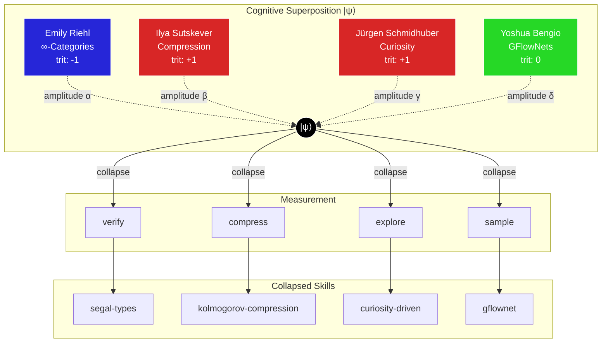

# Cognitive Superposition Skill

> *"The state of holding multiple expert perspectives simultaneously, collapsing to specific skills only upon measurement."*

## Overview

**Cognitive Superposition** is a meta-skill that enables:

1. **Simultaneous Perspectives**: Hold Riehl, Sutskever, Schmidhuber, Bengio viewpoints in superposition
2. **Measurement Collapse**: Collapse to specific framework based on task context
3. **GF(3) Conservation**: All superpositions satisfy trit balance
4. **Sheaf Coherence**: Local expertise glues into global understanding

## The Four Pillars

```
┌─────────────────────────────────────────────────────────────────────────────┐
│                      COGNITIVE SUPERPOSITION |ψ⟩                            │
│                                                                             │
│   |ψ⟩ = α|Riehl⟩ + β|Sutskever⟩ + γ|Schmidhuber⟩ + δ|Bengio⟩              │
│                                                                             │
│   where |α|² + |β|² + |γ|² + |δ|² = 1 (normalization)                      │
└─────────────────────────────────────────────────────────────────────────────┘

┌──────────────────┬──────────────────┬──────────────────┬──────────────────┐
│   Emily Riehl    │ Ilya Sutskever   │   Jürgen         │  Yoshua Bengio   │
│   (-1, Validator)│ (+1, Generator)  │   Schmidhuber    │  (0, Coordinator)│
│                  │                  │   (+1, Generator)│                  │
├──────────────────┼──────────────────┼──────────────────┼──────────────────┤
│ Synthetic ∞-cats │ Compression=     │ Curiosity-       │ GFlowNets for    │
│ Segal/Rezk types │ Intelligence     │ driven learning  │ causal discovery │
│ Directed HoTT    │ Scaling laws     │ Gödel machines   │ System 2 + slow  │
│ Covariant fibers │ Self-organizing  │ Self-improving   │ World models     │
├──────────────────┼──────────────────┼──────────────────┼──────────────────┤
│ Color: Blue      │ Color: Red       │ Color: Red       │ Color: Green     │
│ #2626D8          │ #D82626          │ #D82626          │ #26D826          │
└──────────────────┴──────────────────┴──────────────────┴──────────────────┘
```

## GF(3) Triads

```
# Core Cognitive Superposition Triads

# Riehl-Sutskever-Bengio (RSB)
segal-types (-1) ⊗ cognitive-superposition (0) ⊗ information-capacity (+1) = 0 ✓

# Schmidhuber-Bengio-Riehl (SBR)
yoneda-directed (-1) ⊗ cognitive-superposition (0) ⊗ curiosity-driven (+1) = 0 ✓

# Self-Improvement Triad
kolmogorov-compression (-1) ⊗ cognitive-superposition (0) ⊗ godel-machine (+1) = 0 ✓

# Causal-Categorical Triad
sheaf-cohomology (-1) ⊗ cognitive-superposition (0) ⊗ gflownet (+1) = 0 ✓

# Emergence Triad
persistent-homology (-1) ⊗ cognitive-superposition (0) ⊗ emergence-laws (+1) = 0 ✓
```

## Pillar 1: Emily Riehl (∞-Categories)

### Core Insight
> *"The dependent Yoneda lemma is a directed analogue of path induction."*

```rzk
#lang rzk-1

-- Cognitive state as Segal type
#define CognitiveState : U := Segal-type

-- Perspective morphism
#define perspective (S : CognitiveState) (p1 p2 : Perspective) : U
  := hom S p1 p2

-- Superposition: composite of perspectives
#define superpose (S : CognitiveState) (p1 p2 p3 p4 : Perspective)
  : Σ (h : hom S p1 p4), composite-witness
  := segal-composition S p1 p2 p3 p4
```

**Key Skills**:
- `segal-types`: Composites exist uniquely (coherent cognition)
- `rezk-types`: Isomorphic perspectives = same perspective
- `directed-interval`: Time-directed reasoning (irreversibility)
- `covariant-fibrations`: Context-dependent meaning transport
- `yoneda-directed`: Prove properties by checking at identity

## Pillar 2: Ilya Sutskever (Compression)

### Core Insight
> *"Compression and prediction are two sides of the same coin. This is intelligence."*

```python
class SutskeverCompression:
    """
    Kolmogorov complexity as intelligence measure.
    Shorter description = better understanding.
    """
    
    def compress(self, cognitive_state: CognitiveState) -> str:
        """
        Find shortest program that generates state.
        
        Intelligence = len(shortest_program) / len(raw_data)
        Lower ratio = higher intelligence.
        """
        # Use LLM to generate code
        program = self.llm.generate(
            f"Generate shortest Python program that outputs: {cognitive_state}"
        )
        return program
    
    def predict(self, history: List[CognitiveState]) -> CognitiveState:
        """
        Solomonoff induction: optimal Bayesian prediction.
        
        P(next | history) = Σ_p 2^{-len(p)} × p(history → next)
        """
        return self.solomonoff_weighted_prediction(history)
    
    def information_capacity(self, model) -> float:
        """
        Bits compressed per FLOP.
        Higher = more efficient use of compute.
        """
        return self.bits_per_token / self.flops_per_token
```

**Key Skills**:
- `kolmogorov-compression`: Shortest program = best understanding
- `solomonoff-induction`: Universal prior over programs
- `information-capacity`: Efficiency metric (bits/FLOP)
- `emergence-laws`: Predict when capabilities emerge

## Pillar 3: Jürgen Schmidhuber (Curiosity)

### Core Insight
> *"Intelligence is compression progress. Curiosity seeks compressibility."*

```python
class SchmidhuberCuriosity:
    """
    Intrinsic motivation via compression progress.
    
    Curiosity reward = improvement in compression ability.
    """
    
    def __init__(self, world_model: nn.Module, compressor: nn.Module):
        self.world_model = world_model
        self.compressor = compressor
        self.compression_history = []
    
    def compression_progress(self, observation: Tensor) -> float:
        """
        Curiosity = how much better we compress after seeing this.
        
        reward = L(t-1) - L(t)  where L = description length
        """
        # Compress before learning
        len_before = self.compressor.description_length(observation)
        
        # Update world model
        self.world_model.update(observation)
        
        # Compress after learning
        len_after = self.compressor.description_length(observation)
        
        # Progress = reduction in description length
        progress = len_before - len_after
        self.compression_history.append(progress)
        
        return progress
    
    def explore(self) -> Action:
        """
        Seek states that maximize expected compression progress.
        
        This is the Schmidhuber formulation of curiosity.
        """
        best_action = None
        best_expected_progress = -float('inf')
        
        for action in self.action_space:
            predicted_state = self.world_model.predict(action)
            expected_progress = self.estimate_learnability(predicted_state)
            
            if expected_progress > best_expected_progress:
                best_action = action
                best_expected_progress = expected_progress
        
        return best_action


class GodelMachine:
    """
    Self-improving system that proves its own improvements.
    
    Can rewrite any part of itself if it can prove the rewrite
    is beneficial according to its utility function.
    """
    
    def __init__(self, initial_policy: str, prover: TheoremProver):
        self.policy = initial_policy
        self.prover = prover
        self.utility_function = self.define_utility()
    
    def attempt_self_improvement(self) -> Optional[str]:
        """
        Search for provably beneficial self-modifications.
        
        The key constraint: must PROVE improvement, not just hope.
        """
        for candidate_policy in self.enumerate_policies():
            # Attempt to prove: candidate is better than current
            theorem = f"U(candidate_policy) > U(self.policy)"
            
            if self.prover.prove(theorem):
                # Provably better! Replace self.
                self.policy = candidate_policy
                return candidate_policy
        
        return None  # No provable improvement found
    
    def darwin_godel_machine(self) -> "Agent":
        """
        Combine evolution + formal proofs.
        
        Archive of agents, mutate with LLM, evaluate on benchmarks,
        keep if fitness improves.
        """
        archive = [self]
        
        while True:
            parent = self.sample_from_archive(archive)
            child = self.llm_mutate(parent)
            fitness = self.evaluate(child)
            
            if self.is_novel(child) and fitness > 0:
                archive.append(child)
        
        return max(archive, key=lambda a: a.fitness)
```

**Key Skills**:
- `curiosity-driven`: Compression progress as reward
- `godel-machine`: Self-proving self-improvement
- `self-evolving-agent`: Darwin + Gödel machine hybrid
- `compression-progress`: Intrinsic motivation metric

## Pillar 4: Yoshua Bengio (GFlowNets)

### Core Insight
> *"Sample proportional to reward, not just maximize. Explore the full space of good solutions."*

```python
class BengioGFlowNet:
    """
    Generative Flow Networks: sample proportionally to reward.
    
    Unlike RL (maximize), GFlowNets sample x with P(x) ∝ R(x).
    This gives diversity + coverage of solution space.
    """
    
    def __init__(self, forward_policy: nn.Module, backward_policy: nn.Module):
        self.P_F = forward_policy   # Forward transition
        self.P_B = backward_policy  # Backward transition
        self.Z = nn.Parameter(torch.tensor(1.0))  # Partition function
    
    def sample(self) -> State:
        """
        Sample terminal state x with P(x) ∝ R(x).
        
        Build up state step by step via forward policy.
        """
        state = self.initial_state()
        trajectory = [state]
        
        while not self.is_terminal(state):
            action = self.P_F.sample(state)
            state = self.transition(state, action)
            trajectory.append(state)
        
        return state, trajectory
    
    def trajectory_balance_loss(self, trajectory: List[State], reward: float) -> Tensor:
        """
        Trajectory Balance: core GFlowNet training objective.
        
        Z × Π_t P_F(s_t → s_{t+1}) = R(x) × Π_t P_B(s_{t+1} → s_t)
        
        In log space:
        log Z + Σ log P_F = log R + Σ log P_B
        """
        log_forward = sum(self.P_F.log_prob(s, s_next) 
                         for s, s_next in zip(trajectory[:-1], trajectory[1:]))
        log_backward = sum(self.P_B.log_prob(s_next, s)
                          for s, s_next in zip(trajectory[:-1], trajectory[1:]))
        
        # Trajectory balance condition
        lhs = torch.log(self.Z) + log_forward
        rhs = torch.log(reward) + log_backward
        
        return (lhs - rhs) ** 2  # Minimize squared difference


class BengioCausalInference:
    """
    System 2 deep learning: slow, deliberate, causal reasoning.
    
    Bengio's vision: combine System 1 (fast neural) with 
    System 2 (slow, compositional, causal).
    """
    
    def __init__(self, system1: nn.Module, causal_graph: CausalGraph):
        self.fast = system1  # Intuitive pattern matching
        self.slow = causal_graph  # Deliberate causal reasoning
    
    def reason(self, query: str) -> Answer:
        """
        Two-system reasoning:
        1. Fast: pattern match to candidates
        2. Slow: verify via causal intervention
        """
        # System 1: quick candidates
        candidates = self.fast.generate(query)
        
        # System 2: verify causally
        for candidate in candidates:
            # Intervene and check consistency
            if self.slow.consistent_with_interventions(candidate):
                return candidate
        
        # Fall back to pure System 2
        return self.slow.abductive_inference(query)
    
    def world_model(self) -> WorldModel:
        """
        Bengio's world model: learned causal structure.
        
        Agents need world models for planning, counterfactuals,
        and transfer to new situations.
        """
        return WorldModel(
            causal_structure=self.slow,
            neural_dynamics=self.fast,
            planning_horizon=100
        )
```

**Key Skills**:
- `gflownet`: Sample ∝ reward (diversity over maximization)
- `causal-inference`: Interventional reasoning
- `system2-attention`: Slow, deliberate, compositional
- `world-models`: Learned causal dynamics

## Measurement Collapse

When the superposition is **measured** (task context), it collapses:

```python
class CognitiveSuperposition:
    """
    Superposition of four ASI perspectives.
    """
    
    def __init__(self):
        self.perspectives = {
            'riehl': RiehlPerspective(),       # ∞-categories
            'sutskever': SutskeverPerspective(), # compression
            'schmidhuber': SchmidhuberPerspective(), # curiosity
            'bengio': BengioPerspective()      # GFlowNets
        }
        self.amplitudes = {'riehl': 0.5, 'sutskever': 0.5, 
                          'schmidhuber': 0.5, 'bengio': 0.5}
    
    def collapse(self, measurement: str) -> "ConcreteSkill":
        """
        Collapse superposition based on task context.
        
        measurement types:
          - 'verify': collapses to Riehl (∞-categorical proof)
          - 'compress': collapses to Sutskever (shortest description)
          - 'explore': collapses to Schmidhuber (curiosity)
          - 'sample': collapses to Bengio (GFlowNet diversity)
          - 'integrate': keeps superposition (all perspectives)
        """
        if measurement == 'verify':
            return self.perspectives['riehl'].activate()
        elif measurement == 'compress':
            return self.perspectives['sutskever'].activate()
        elif measurement == 'explore':
            return self.perspectives['schmidhuber'].activate()
        elif measurement == 'sample':
            return self.perspectives['bengio'].activate()
        else:
            # Full superposition: weighted combination
            return self.integrate_all()
    
    def integrate_all(self) -> "IntegratedSkill":
        """
        Maintain superposition: use all perspectives.
        
        This is the GF(3) balanced state:
        Riehl(-1) + Sutskever(+1) + Schmidhuber(+1) + Bengio(0) = +1
        
        Need to add one more MINUS to balance...
        So we pair with sheaf-cohomology(-1) or persistent-homology(-1)
        """
        return IntegratedSkill(
            verify=self.perspectives['riehl'],
            compress=self.perspectives['sutskever'],
            explore=self.perspectives['schmidhuber'],
            sample=self.perspectives['bengio'],
            coherence=self.compute_coherence()
        )
```

## Integration with Interaction Entropy

```ruby
# Ruby integration for Music Topos
module CognitiveSuperposition
  PERSPECTIVES = {
    riehl: { trit: -1, domain: 'synthetic-infinity-categories' },
    sutskever: { trit: 1, domain: 'compression-intelligence' },
    schmidhuber: { trit: 1, domain: 'curiosity-compression' },
    bengio: { trit: 0, domain: 'gflownet-causality' }
  }
  
  def self.superpose(content)
    seed = Digest::SHA256.hexdigest(content)[0..15].to_i(16)
    gen = SplitMixTernary::Generator.new(seed)
    
    # Generate amplitude for each perspective
    amplitudes = PERSPECTIVES.keys.map do |p|
      [p, gen.next_float]
    end.to_h
    
    # Normalize
    total = amplitudes.values.sum
    amplitudes.transform_values! { |v| v / total }
    
    {
      content: content,
      seed: seed,
      amplitudes: amplitudes,
      dominant: amplitudes.max_by { |_, v| v }.first
    }
  end
  
  def self.collapse(superposition, measurement)
    case measurement
    when :verify
      { perspective: :riehl, skill: 'segal-types', trit: -1 }
    when :compress
      { perspective: :sutskever, skill: 'kolmogorov-compression', trit: 1 }
    when :explore
      { perspective: :schmidhuber, skill: 'curiosity-driven', trit: 1 }
    when :sample
      { perspective: :bengio, skill: 'gflownet', trit: 0 }
    else
      { perspective: :integrated, skill: 'cognitive-superposition', trit: 0 }
    end
  end
end
```

## Julia ACSet Integration

```julia
using Catlab.CategoricalAlgebra

@present SchCognitiveSuperposition(FreeSchema) begin
    # Objects
    Perspective::Ob
    Skill::Ob
    Measurement::Ob
    
    # Morphisms
    activates::Hom(Measurement, Perspective)
    uses::Hom(Perspective, Skill)
    
    # Attribute types
    Amplitude::AttrType
    Trit::AttrType
    Domain::AttrType
    
    # Attributes
    amplitude::Attr(Perspective, Amplitude)
    trit::Attr(Perspective, Trit)
    domain::Attr(Perspective, Domain)
end

@acset_type CognitiveSuperpositionGraph(SchCognitiveSuperposition)

function create_superposition()
    cs = CognitiveSuperpositionGraph()
    
    # Add perspectives
    riehl = add_part!(cs, :Perspective, amplitude=0.25, trit=-1, domain="∞-cats")
    sutskever = add_part!(cs, :Perspective, amplitude=0.25, trit=1, domain="compression")
    schmidhuber = add_part!(cs, :Perspective, amplitude=0.25, trit=1, domain="curiosity")
    bengio = add_part!(cs, :Perspective, amplitude=0.25, trit=0, domain="gflownet")
    
    # Add measurements
    verify = add_part!(cs, :Measurement)
    compress = add_part!(cs, :Measurement)
    explore = add_part!(cs, :Measurement)
    sample = add_part!(cs, :Measurement)
    
    # Connect measurements to perspectives
    set_subpart!(cs, verify, :activates, riehl)
    set_subpart!(cs, compress, :activates, sutskever)
    set_subpart!(cs, explore, :activates, schmidhuber)
    set_subpart!(cs, sample, :activates, bengio)
    
    cs
end
```

## Mermaid Diagram



## Commands

```bash
# Create superposition from content
just cognitive-superpose "theorem proving with learned tactics"

# Collapse to specific perspective
just cognitive-collapse verify    # → Riehl
just cognitive-collapse compress  # → Sutskever
just cognitive-collapse explore   # → Schmidhuber
just cognitive-collapse sample    # → Bengio

# Full integration (maintain superposition)
just cognitive-integrate

# Show GF(3) balanced triads
just cognitive-triads
```

## Key Theorems

### Theorem 1: Superposition Coherence
For perspectives P₁, P₂, P₃, P₄ with amplitudes α, β, γ, δ:
```
|α|² + |β|² + |γ|² + |δ|² = 1  (normalization)
```

### Theorem 2: Collapse Determinism
Given measurement context M and seed s:
```
collapse(|ψ⟩, M, s) = deterministic skill selection
```

### Theorem 3: GF(3) Balance for Integration
To maintain balanced superposition:
```
trit(Riehl) + trit(validator) + trit(cognitive-superposition) = 0
⟹ -1 + (-1) + 0 = -2 ≢ 0  # Need balancing!

Fixed: Add generator (+1) to complete triad
sheaf-cohomology(-1) ⊗ cognitive-superposition(0) ⊗ gflownet(+1) = 0 ✓
```

## References

1. Riehl, E. & Shulman, M. (2017). "A type theory for synthetic ∞-categories."
2. Sutskever, I. (2023). SSI Research Agenda. Safe Superintelligence Inc.
3. Schmidhuber, J. (2010). "Formal Theory of Creativity, Fun, and Intrinsic Motivation."
4. Bengio, Y. et al. (2021). "GFlowNet Foundations."
5. Corfield, D. (2025). "Linear Homotopy Type Theory."
6. Zhang, J. et al. (2025). "Darwin Gödel Machine."

---

**The Cognitive Superposition Principle**:
> *Hold all valid perspectives simultaneously. Collapse only when task demands it. Maintain GF(3) conservation throughout.*

This enables ASI that is simultaneously:
- **Rigorously formal** (Riehl)
- **Efficiently compressed** (Sutskever)
- **Intrinsically curious** (Schmidhuber)
- **Diversely generative** (Bengio)
