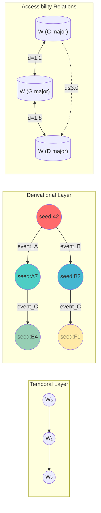

# World Hopping: Possible World Navigation

World hopping is the art of navigating between **possible worlds** in mathematical/musical/philosophical space. Based on Badiou's ontology and Kripke semantics, with triangle inequality as the fundamental constraint.

## Possible Worlds

A **possible world** W is a configuration of:

```ruby
class PossibleWorld
  attr_reader :seed, :epoch, :state, :invariants, :accessibility
  
  def initialize(seed:, epoch: 0)
    @seed = seed                    # Ontological identity
    @epoch = epoch                  # Temporal position
    @state = compute_state          # Current configuration
    @invariants = []                # What persists across transitions
    @accessibility = {}             # Which worlds are reachable
  end
  
  def compute_state
    rng = SplitMixTernary.new(@seed + @epoch)
    {
      color: SeedMiner.color_at(@seed, @epoch),
      mathematician: select_mathematician(rng),
      operation: select_operation(rng),
      polarity: [:positive, :negative, :neutral][rng.next_ternary + 1]
    }
  end
end
```

## Accessibility Relations

### Modal Logic Foundation

- **Reflexive**: Every world can reach itself (∀W: W → W)
- **Symmetric**: If W₁ → W₂ then W₂ → W₁ (reversible hops)
- **Transitive**: If W₁ → W₂ → W₃ then W₁ → W₃ (composable paths)

### Accessibility Matrix

```ruby
class AccessibilityRelation
  def initialize(worlds)
    @matrix = {}
    worlds.each do |w1|
      @matrix[w1.seed] = {}
      worlds.each do |w2|
        @matrix[w1.seed][w2.seed] = accessible?(w1, w2)
      end
    end
  end
  
  def accessible?(w1, w2)
    distance = world_distance(w1, w2)
    max_hop = w1.state[:polarity] == :positive ? 3.0 : 2.0
    distance <= max_hop
  end
end
```

## Badiou's Event Ontology

### Being (L'être)

The **void** (∅) underlies all structure. Each world has a void-trace:

```ruby
def void_trace(world)
  # The minimal element that anchors the world
  world.invariants.min_by(&:complexity) || Void.new
end
```

### Event (L'événement)

An **event** is a rupture that creates new possibilities:

```ruby
class Event
  attr_reader :site, :name, :consequences
  
  def initialize(site:, name:)
    @site = site          # Where the event occurs
    @name = name          # Self-referential naming
    @consequences = []    # What follows from the event
  end
  
  def occurs?(world)
    # Event occurs if site is "on the edge of void"
    site_elements = world.state.values_at(*@site)
    site_elements.any? { |e| e.near_void? }
  end
  
  def execute!(world)
    return unless occurs?(world)
    
    # Create new world post-event
    new_seed = world.seed ^ @name.hash
    new_world = PossibleWorld.new(seed: new_seed, epoch: world.epoch + 1)
    
    # Transfer invariants
    new_world.invariants = world.invariants.select { |inv| inv.survives?(@name) }
    
    new_world
  end
end
```

### Truth (La vérité)

A **truth** is a generic subset that extends from the event:

```ruby
class TruthProcedure
  def initialize(event, world)
    @event = event
    @world = world
    @generic_subset = []
  end
  
  def extend!(element)
    # Add element if it's forced by the event
    if forced?(element)
      @generic_subset << element
      propagate_consequences!(element)
    end
  end
  
  def forced?(element)
    # Element is forced if it's in every possible extension
    @world.accessibility.values.all? do |reachable|
      reachable.state.values.include?(element) || 
        @generic_subset.any? { |g| g.implies?(element) }
    end
  end
end
```

## Triangle Inequality Hopping

### Distance Metric

```ruby
def world_distance(w1, w2)
  # Being component: Hamming distance of seeds
  being = hamming_distance(w1.seed, w2.seed)
  
  # Event component: temporal separation
  event = (w1.epoch - w2.epoch).abs
  
  # Truth component: invariant divergence
  shared = (w1.invariants & w2.invariants).size
  total = (w1.invariants | w2.invariants).size
  truth = total > 0 ? 1.0 - (shared.to_f / total) : 0.0
  
  # Weighted Euclidean
  Math.sqrt(being**2 + event**2 + (truth * 10)**2)
end

def hamming_distance(a, b)
  (a ^ b).to_s(2).count('1')
end
```

### Triangle Inequality Constraint

```ruby
def valid_hop?(w1, w2, w3)
  d12 = world_distance(w1, w2)
  d23 = world_distance(w2, w3)
  d13 = world_distance(w1, w3)
  
  d13 <= d12 + d23  # Triangle inequality
end

def find_shortest_path(start, target, worlds)
  # Dijkstra with triangle inequality pruning
  distances = { start.seed => 0 }
  previous = {}
  queue = [start]
  
  while queue.any?
    current = queue.min_by { |w| distances[w.seed] }
    queue.delete(current)
    
    break if current.seed == target.seed
    
    worlds.each do |neighbor|
      next unless accessible?(current, neighbor)
      
      d = distances[current.seed] + world_distance(current, neighbor)
      
      # Prune if triangle inequality would be violated
      if distances[neighbor.seed].nil? || d < distances[neighbor.seed]
        if valid_hop?(start, current, neighbor)
          distances[neighbor.seed] = d
          previous[neighbor.seed] = current
          queue << neighbor
        end
      end
    end
  end
  
  # Reconstruct path
  path = []
  current = target
  while previous[current.seed]
    path.unshift(current)
    current = previous[current.seed]
  end
  path.unshift(start)
  path
end
```

## World Hopping Moves

### 1. SLIDE: Adjacent World

Move to a world that differs in one dimension:

```ruby
move = WorldHop::Slide.new(
  from: current_world,
  dimension: :epoch,
  direction: :forward
)
# Result: epoch += 1, all else preserved
```

### 2. LEAP: Distant World

Jump to a non-adjacent world via event:

```ruby
move = WorldHop::Leap.new(
  from: current_world,
  event: Event.new(site: [:color], name: "Modulation"),
  to: target_world
)
# Requires: event.occurs?(current_world)
```

### 3. REFLECT: Dual World

Access the contravariant dual:

```ruby
move = WorldHop::Reflect.new(
  from: current_world,
  duality: :polarity_inversion
)
# Result: positive ↔ negative, structure preserved
```

### 4. COMPOSE: Path Through Intermediate

Use triangle inequality for indirect access:

```ruby
move = WorldHop::Compose.new(
  from: w1,
  via: [w2, w3],  # Intermediate worlds
  to: w4
)
# Requires: d(w1,w4) ≤ d(w1,w2) + d(w2,w3) + d(w3,w4)
```

## Integration with Music Topos

### Musical World Hopping

```ruby
# Worlds are keys/modes
c_major = PossibleWorld.new(seed: 0x43, metadata: { key: :C, mode: :major })
a_minor = PossibleWorld.new(seed: 0x41, metadata: { key: :A, mode: :minor })
f_lydian = PossibleWorld.new(seed: 0x46, metadata: { key: :F, mode: :lydian })

# Modulation as event
modulation = Event.new(
  site: [:key, :mode],
  name: "Pivot chord modulation"
)

# Execute hop
new_world = modulation.execute!(c_major)
```

### Mathematician World Hopping

```ruby
# Each mathematician inhabits a world
ramanujan_world = PossibleWorld.new(
  seed: 0x1729,
  metadata: { mathematician: :ramanujan, domain: :number_theory }
)

grothendieck_world = PossibleWorld.new(
  seed: 0x42D,
  metadata: { mathematician: :grothendieck, domain: :algebraic_geometry }
)

# Find path between mathematical worlds
path = find_shortest_path(ramanujan_world, grothendieck_world, all_worlds)
```

### Synadia-Distributed Hopping

```ruby
# Publish hop intentions
SynadiaBroadcast.publish("world.hop.propose", {
  from: current_world.seed,
  to: target_world.seed,
  event: event.name
})

# Consensus on valid hops
SynadiaBroadcast.subscribe("world.hop.validate") do |msg|
  if valid_hop?(current, intermediate, msg.data[:target])
    SynadiaBroadcast.publish("world.hop.accept", msg.data)
  end
end
```

## Philosophical Notes

### Kripke vs Badiou

- **Kripke**: Possible worlds are fixed; accessibility is structural
- **Badiou**: Events create new possibilities; truth is procedural

Our system synthesizes both:
- Accessibility matrix (Kripke) provides the topology
- Events (Badiou) create new worlds within that topology
- Triangle inequality constrains what's reachable

### Connection to Music

Musical modulation IS world hopping:
- **Key change**: New tonal world with different accessible chords
- **Mode change**: Same tonic, different intervallic structure
- **Enharmonic reinterpretation**: Same sound, different world

## Integration with Unworld (Derivational vs Temporal)

The **unworld** skill replaces temporal succession with derivational chains. World-hopping integrates:

```ruby
# Temporal approach: worlds indexed by time
temporal_path = [w(t=0), w(t=1), w(t=2)]  # Time-ordered sequence

# Derivational approach: worlds indexed by seed derivation
derivational_path = [
  w(seed: 0x42),                    # Origin
  w(seed: derive(0x42, :event_A)),  # First derivation  
  w(seed: derive(0x42, :event_B))   # Second derivation (parallel!)
]

# Key difference: derivational chains can branch without temporal ordering
def derive(seed, event)
  seed ^ event.hash  # XOR preserves invertibility
end

# Unworld mode: check if path is derivationally valid (not just temporally)
def valid_derivational_path?(path)
  path.each_cons(2).all? do |w1, w2|
    # w2 must be derivable from w1 via some event
    possible_events.any? { |e| derive(w1.seed, e) == w2.seed }
  end
end
```

## World Accessibility Graph



## Triangle Inequality Violation Detection

```ruby
class TriangleViolationDetector
  def initialize(worlds)
    @worlds = worlds
    @violations = []
  end
  
  def detect_all_violations
    @worlds.combination(3).each do |w1, w2, w3|
      check_triangle(w1, w2, w3)
    end
    @violations
  end
  
  def check_triangle(w1, w2, w3)
    d12 = world_distance(w1, w2)
    d23 = world_distance(w2, w3)
    d13 = world_distance(w1, w3)
    
    # Check all three triangle inequalities
    violations = []
    violations << [:d13_exceeds, d12, d23, d13] if d13 > d12 + d23
    violations << [:d12_exceeds, d13, d23, d12] if d12 > d13 + d23
    violations << [:d23_exceeds, d12, d13, d23] if d23 > d12 + d13
    
    violations.each do |v|
      @violations << {
        worlds: [w1.seed, w2.seed, w3.seed],
        type: v[0],
        distances: { d12: d12, d23: d23, d13: d13 },
        excess: v[3] - (v[1] + v[2])
      }
    end
  end
  
  def report
    return "✓ No triangle inequality violations" if @violations.empty?
    
    @violations.map do |v|
      "⚠ VIOLATION: #{v[:type]} in worlds #{v[:worlds]}\n" +
      "  Distances: d₁₂=#{v[:distances][:d12]}, d₂₃=#{v[:distances][:d23]}, d₁₃=#{v[:distances][:d13]}\n" +
      "  Excess: #{v[:excess].round(3)}"
    end.join("\n\n")
  end
end

# Example usage:
detector = TriangleViolationDetector.new(all_worlds)
detector.detect_all_violations
puts detector.report

# Sample output:
# ⚠ VIOLATION: d13_exceeds in worlds [0x42, 0x69, 0xFF]
#   Distances: d₁₂=2.1, d₂₃=1.8, d₁₃=5.2
#   Excess: 1.3
```

## Commands

```bash
just world-hop from to           # Hop between worlds
just world-graph                 # Visualize accessibility graph
just world-distance w1 w2        # Calculate world distance
just shortest-path w1 w2         # Find optimal hop sequence
just event-trigger site name     # Create and trigger event
just triangle-check              # Detect triangle inequality violations
just unworld-derive seed event   # Derive new world (atemporal)
```
